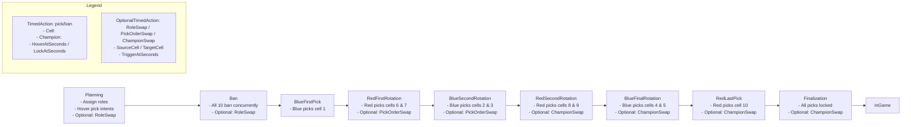

# Draft Pick Overview

This document summarizes the Draft Pick flow used by JoinGameAfk and the MockLeagueClient YAML samples.

- Teams: Blue (cells 1–5) vs Red (cells 6–10). Roles: top, jungle, mid, adc, support.
- Local context: LocalSlot (cell id of local player), LocalRole (assigned role), RevealEnemyPickIntents (optional).
- Actions per phase:
  - TimedAction type: pick or ban, optional HoverAtSeconds and LockAtSeconds
  - OptionalTimedAction types: RoleSwap, PickOrderSwap, ChampionSwap (with SourceCell, TargetCell, TriggerAtSeconds)
- Step order:
  - Planning → Ban → BlueFirstPick → RedFirstRotation → BlueSecondRotation → RedSecondRotation → BlueFinalRotation → RedLastPick → Finalization → InGame

## YAML Schema

Root fields
- Version: number
- QueueId: number
- QueueName: string
- LocalSlot: number (alias: LocalPlayerCellId)
- LocalRole: string (alias: LocalPlayerRole)
- RevealEnemyPickIntents: bool
- ActivePhase: string (one of the DraftPickStep names or display names)

Teams
- BlueTeam: array of { Cell: int, Role: string }
- RedTeam: array of { Cell: int, Role: string }

Phases
- Each phase key (Planning, Ban, BlueFirstPick, RedFirstRotation, BlueSecondRotation, RedSecondRotation, BlueFinalRotation, RedLastPick, Finalization, InGame) has:
  - TimeLeftSeconds: int
  - TimedActions: array of
    - { Cell: int, Type: pick|ban, Champion: string?, HoverAtSeconds?: int, LockAtSeconds?: int }
  - OptionalTimedActions: array of
    - { Id?: int, Type: RoleSwap|PickOrderSwap|ChampionSwap, SourceCell?: int, TargetCell?: int, TriggerAtSeconds?: int }

## Behavior & Normalization
- Step names map to DraftPickStep enum; display names via DraftPickSteps.
- Action types normalized to "pick" or "ban".
- Champion names resolved to IDs via ChampionCatalog.
- OptionalTimedAction types parsed case-insensitively; display names allowed.
- TimeLeftSeconds, HoverAtSeconds, LockAtSeconds clamped to >= 0.

## Sound Alerts Between Phases
JoinGameAfk plays sound alerts on key phase transitions and during pick/ban timing:
- Phase transitions (PhaseController):
  - ReadyCheck: plays ReadyCheck alert
  - Entering ChampSelect: plays ChampSelectStart
  - Exiting ChampSelect (dodge/return): plays ChampSelectEnded
- Champion Select (ChampSelect):
  - Action start: pick → PickActionStart, ban → BanActionStart
  - All configured options unavailable: AllOptionsUnavailable
  - Scheduled auto-lock countdowns: PickLockCountdown/BanLockCountdown and PickLockSoon/BanLockSoon
  - Auto-lock complete: PickLockComplete/BanLockComplete
- All alerts respect SoundSettings (volume, thresholds, infinite playback, per-alert enable/disable) and NotificationSoundPlayer.

## Samples
See YAML examples:
- JoinGameAfk.Tools/JoinGameAfk.Tools.MockLeagueClient/Samples/full-champion-select-flow.yaml
- JoinGameAfk.Tools/JoinGameAfk.Tools.MockLeagueClient/Samples/short-champion-select-flow.yaml
- JoinGameAfk.Tools/JoinGameAfk.Tools.MockLeagueClient/Samples/short-champion-select-flow-cell1-open.yaml
