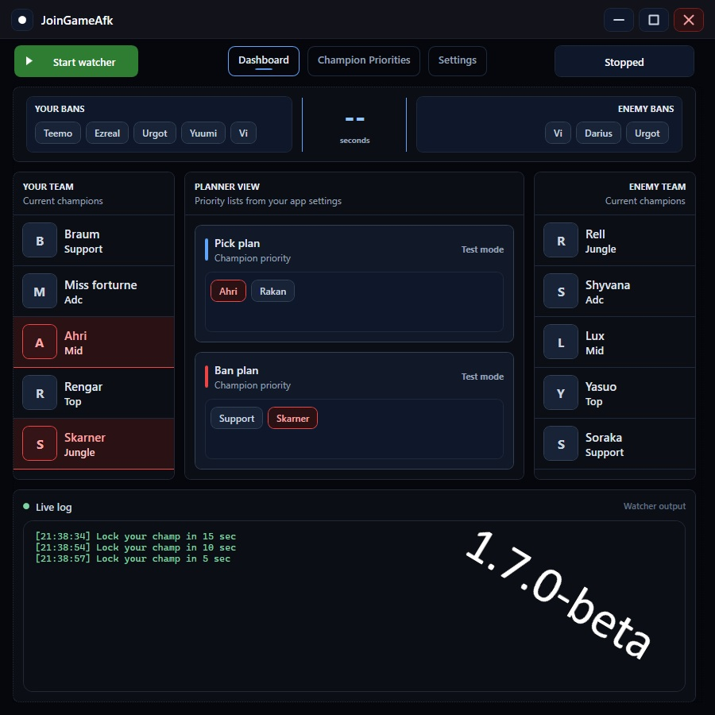
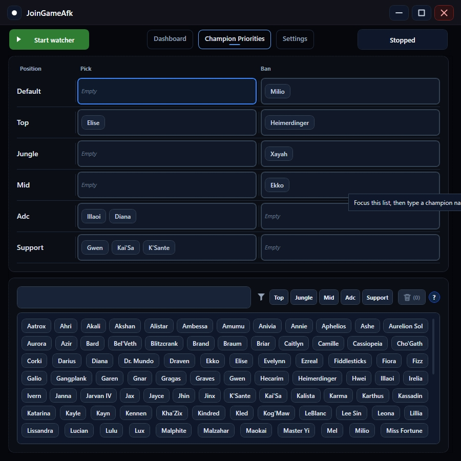

# JoinGameAfk

> A Windows desktop helper for league of legends, ready check auto-accept, and champion select automation.

**License:** MIT  
**Status:** Freeware / Open source  
**Platform:** Windows  

> [!IMPORTANT]
> Users should review the code and build it if they want maximum confidence.

---

## Screenshots

### Dashboard



### Champion Priorities



---

## What this app does

JoinGameAfk is a Windows WPF app that monitors the local **League Client** state and helps automate a few repetitive actions:

- watches the League Client phase
- auto-accepts ready checks after a configurable delay
- detects champion select and planning phases
- lets you configure **pick** and **ban** priority lists per role
- attempts to hover champions from your configured priority lists
- can auto-lock your current pick or ban near the end of the timer
- shows a live status/log view in the dashboard

In short: it is a local desktop assistant for champion select flow management.

---

## What this app is not doing in v1.0.0

- send data to a custom remote server
- require a cloud account
- include a bundled updater
- include ads, subscriptions, or paywalled features
- hide what it is doing internally

The current network calls in source are directed to the **local League Client API** at:

- `https://127.0.0.1:<port>/...`

That port and local auth token are discovered from the local League Client process at runtime.

---

### 1. The app is small and focused
The current codebase is centered around a narrow feature set:

- process detection for `LeagueClientUx`
- local League Client authentication discovery
- polling the local client phase
- ready check acceptance
- champion select hover / lock actions
- WPF UI for settings and logs

### 2. The behavior is visible in the UI
The app exposes:

- a dashboard with current state
- connection status
- start/stop control
- a visible action log
- editable configuration pages

### 3. Settings are plain local files
From the current source, configuration is stored locally as JSON files in:

- `%LocalAppData%\JoinGameAfk`

including:

- `configuration.json`
- `champions.json`

This makes the app easier to inspect, back up, and remove.

---

## Main features

### Dashboard
The dashboard page provides:

- a **Start / Stop** button for the watcher
- current app state (`Stopped`, `Waiting for client`, `Ready Check`, `Champion Select`, etc.)
- League Client connection status
- a scrolling log of actions and errors

### Ready Check automation
When enabled by simply running the watcher, the app can:

- detect a ready check
- wait for a configurable delay
- auto-accept if the ready check is still active
- skip the accept if you already handled it manually

### Champion Select automation
The champion select flow currently supports:

- role-based preference lists
- separate **Pick** and **Ban** priority lists
- drag-and-drop reordering of priorities
- hover delay before attempting a champion
- optional auto-lock close to timer expiry
- fallback behavior when you manually change the selected champion

### Settings page
The settings page currently exposes:

- ready check accept delay
- champion hover delay
- pick lock timer
- ban lock timer
- auto-lock enable/disable
- champ select polling rate

---

## How it works

At a high level, the app:

1. Starts a watcher loop
2. Looks for the local `LeagueClientUx` process
3. Reads the local command line to extract:
   - app port
   - local remoting auth token
4. Connects to the local League Client API
5. Polls the gameflow session phase
6. Runs phase-specific handlers

Current implemented handlers found in source:

- **ReadyCheck**
- **ChampSelect**

The champion select handler then:

- reads your assigned position
- loads your preferred picks/bans for that role
- attempts hover actions in priority order
- optionally locks at the configured timing threshold

---

## Data and privacy

### What the app reads
From the current implementation, the app reads:

- the local League Client process command line
- local League Client session state
- local champion select session state
- your locally saved app settings

### What the app writes
From the current implementation, the app writes local files such as:

- `configuration.json`
- `champions.json` (if missing, a default version may be created)

It also writes runtime messages to:

- the in-app log view
- the standard console output

### What the app sends over the network
From the current code, the app sends requests to the **local League Client API only**.

Observed action types include:

- accept ready check
- hover champion
- complete pick/ban action

---

## Safety and limitations

Please use the app carefully.

- This tool automates actions in a game client workflow.
- Behavior may break after League Client updates.
- Timing-sensitive actions can fail if the client API changes or becomes unavailable.
- If you manually change your pick/ban, the app may switch to a fallback locking behavior based on your current selection.
- Polling too aggressively may be unnecessary; the settings page already constrains the polling interval to a safer range.

---

## Project structure

Current repository layout appears to be:

- `JoinGameAfk/` - WPF desktop application and UI
- `JoinGameAfk.Common/` - shared models, enums, constants, champion catalog, settings
- `JoinGameAfk.Plugin/` - local client access and phase handlers

Notable components:

- `App.xaml.cs` - application startup and window/page composition
- `MainWindow` - custom shell window with tabs
- `PhaseProgressionPage` - dashboard/status/log screen
- `ChampSelectSettingsPage` - pick/ban priority editor
- `SettingsPage` - timing and polling configuration
- `PhaseController` - main watcher loop and phase dispatch
- `LeagueClientHttp` - local client HTTP wrapper
- `ProcessManager` - reads League Client launch arguments
- `ChampSelectSettings` - JSON-backed app configuration
- `ChampionCatalog` - champion ID/name source and fallback list

---

## Build from source

### Requirements

- Windows
- .NET 9 SDK
- Visual Studio 2026 or another .NET-capable IDE/CLI
- League Client installed if you want to use the automation features

### Build

```powershell
dotnet build
```

### Publish as a single executable

```powershell
dotnet publish .\JoinGameAfk\JoinGameAfk.csproj -c Release -r win-x64 -p:PublishSingleFile=true -p:SelfContained=true
```

The published app can stay as a single exe because editable files are stored in `%LocalAppData%\JoinGameAfk` instead of next to the executable.

### Run

```powershell
dotnet run --project .\JoinGameAfk\JoinGameAfk.csproj
```

---

## Usage

1. Start the app
2. Open the **Champion Select** page and configure pick/ban priorities for each position
3. Open the **Settings** page and adjust delays/timers if needed
4. Use **Open Storage Folder** from the Settings page if you want to inspect or back up the JSON files
5. Return to **Dashboard**
6. Click **Start**
7. Launch or keep the League Client open
8. Watch the dashboard log for connection and phase activity

---

## Configuration files

From the current codebase, these files are stored in `%LocalAppData%\JoinGameAfk`.

The Settings page also includes a button to open this folder directly.

Both configuration files include a `Version` field. Current schema version is `1`.

### `configuration.json`
Stores:

- configuration schema version
- selected theme
- ready check delay
- hover delay
- pick lock delay
- ban lock delay
- polling interval
- auto-lock flag
- pick/ban preferences by role

### `champions.json`
Stores:

- configuration schema version
- champion IDs and display names used by the UI

If the file is missing, the app can fall back to a built-in default champion list and recreate the file.

---

## Open source and MIT license

This project is intended to be distributed as **freeware** and **open source under the MIT License**.

That generally means:

- you can use it
- you can study it
- you can modify it
- you can redistribute it

as long as the MIT license terms are included.

**Placeholder:** Add a `LICENSE` file with the full MIT text if it is not already present in the repository.

---

## Non-affiliation

> This project is an independent open-source tool and is not affiliated with, endorsed by, or sponsored by Riot Games.

---

## Security notes

Users should understand these implementation details:

- the app inspects the local League Client process command line
- the app uses the local remoting auth token exposed by the running client process
- the app disables certificate validation for local client HTTPS calls to `127.0.0.1`

---

## Contributing

Contributions are welcome.

---

## FAQ

### Does this require the Riot Client or League Client to already be running?
Yes. The current implementation waits for the local League Client process and then connects to its local API.

### Does it work without configuration?
It can start and watch phases, but champion select automation is only useful after you configure preferred picks/bans.

### Where are my settings saved?
Settings are stored in `%LocalAppData%\JoinGameAfk\configuration.json`.

### Does it upload my data anywhere?
From the current source review, no external upload or telemetry service was identified.

### Can I inspect what it is doing?
Yes. The project is source-available in this repository, and the app also shows runtime activity in its dashboard log.

---

## Final note

This project earns trust best by staying simple, readable, and explicit about what it automates.
