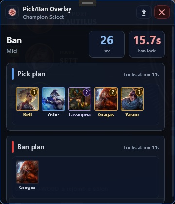

# JoinGameAfk

> A free Windows helper for League of Legends ready checks, champion priority planning, and champion select pick/ban flow.

**Platform:** Windows  
**License:** MIT  
**Status:** Free, open source fan project  

> [!IMPORTANT]
> This app automates actions in the local League Client. Use it carefully, and review the code if you want maximum confidence.

> [!NOTE]
> JoinGameAfk was created under Riot Games' "Legal Jibber Jabber" policy using assets owned by Riot Games. Riot Games does not endorse or sponsor this project.

---

## Screenshots

### Dashboard


The dashboard shows the current phase, timers, bans, both teams, role-aware pick/ban plans, unavailable champion warnings, and the live watcher log.

### Champion Priorities


Build pick and ban priority lists per role with champion tiles, search, role filters, drag-and-drop ordering, and per-champion picture selection.

### Pick/Ban Overlay



The optional overlay keeps your current pick and ban plan visible during champion select without needing the main window in front.

---

## What It Does

- Auto-accepts ready checks after a configurable delay.
- Lets you configure role-specific pick and ban priorities.
- Attempts to hover champions from your priority list during champion select.
- Can auto-lock your current pick or ban near the end of the timer.
- Shows current teams, bans, timers, blocked champions, and action logs.
- Provides a compact pick/ban overlay for champion select.
- Uses Riot Data Dragon champion names and tile images stored locally.

---

## Quick Start

1. Open JoinGameAfk.
2. Go to **Champion Priorities** and set your pick/ban lists.
3. Go to **Settings** and adjust timers, theme, and champion pictures if needed.
4. Return to **Dashboard**.
5. Click **Start** while the League Client is open.
6. Watch the dashboard or open the pick/ban overlay during champion select.

---

## Privacy

JoinGameAfk is local-first:

- No account is required.
- No ads, telemetry, subscriptions, or custom remote server are used.
- Settings are stored in `%LocalAppData%\JoinGameAfk`.
- League actions use the local League Client API at `https://127.0.0.1:<port>/...`.
- Riot Data Dragon is only contacted when updating champion data or downloading champion pictures.

---

## Build From Source

### Requirements

- Windows
- .NET 10 SDK
- League Client installed if you want to use the automation features

### Build

```powershell
dotnet build
```

### Run

```powershell
dotnet run --project .\JoinGameAfk\JoinGameAfk.csproj
```

### Publish

```powershell
dotnet publish .\JoinGameAfk\JoinGameAfk.csproj -c Release -r win-x64 -p:PublishSingleFile=true -p:SelfContained=true
```

---

## License

JoinGameAfk is released under the MIT License. See `LICENSE`.

---

## Riot Games Notice

JoinGameAfk is a free, non-commercial fan project. It uses public champion names from Riot Data Dragon to identify player-configured pick/ban preferences. Champion pictures, when configured or shown in screenshots, are Riot Games-owned assets provided through Riot Data Dragon and loaded from local app storage.

> JoinGameAfk was created under Riot Games' "Legal Jibber Jabber" policy using assets owned by Riot Games. Riot Games does not endorse or sponsor this project.

> JoinGameAfk is not endorsed by Riot Games and does not reflect the views or opinions of Riot Games or anyone officially involved in producing or managing Riot Games properties. Riot Games and all associated properties are trademarks or registered trademarks of Riot Games, Inc.

Champion image cache files are generated or downloaded from Riot Data Dragon for local app use. Source control ignores `JoinGameAfk/Assets/ChampionTiles/` and `JoinGameAfk/Assets/champion-tile-cache.json`.
