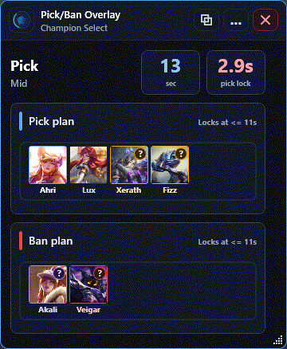
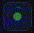
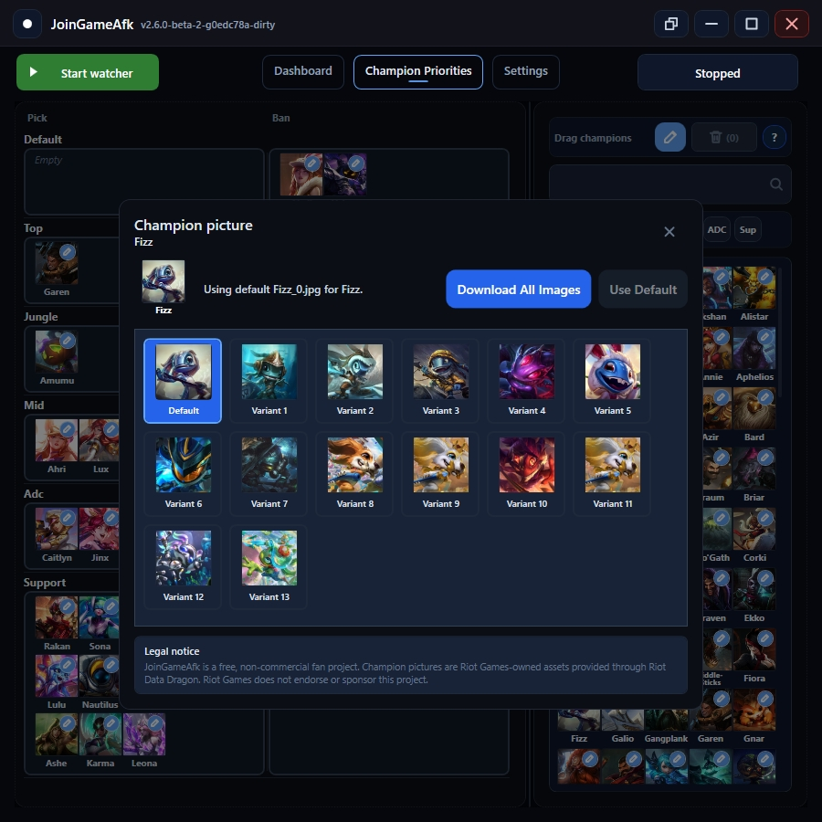
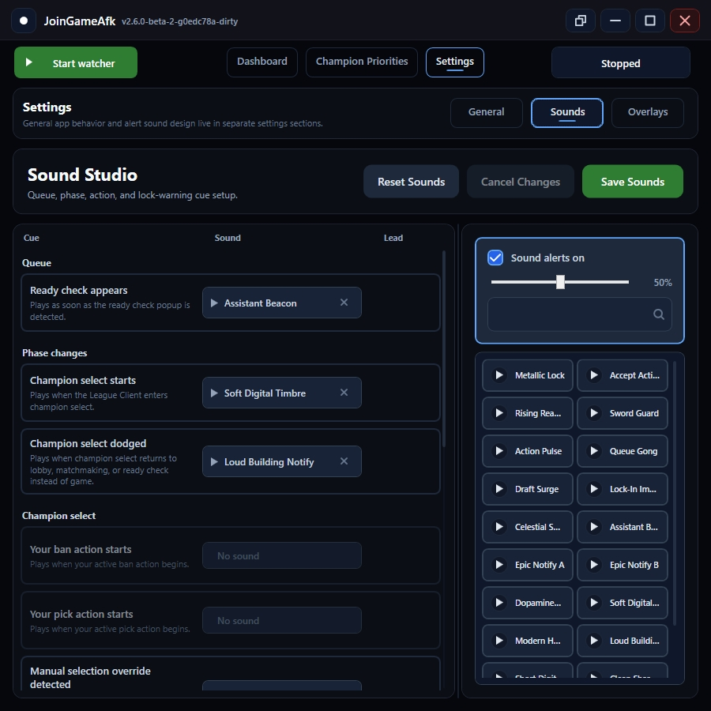

# JoinGameAfk

> A free Windows helper for League of Legends ready checks, champion priority planning, and champion select pick/ban flow.

**Platform:** Windows  
**License:** MIT  
**Status:** Free, open source fan project  

> [!IMPORTANT]
> This app automates actions in the local League Client. Use it carefully, and review the code if you want maximum confidence.

> [!NOTE]
> JoinGameAfk was created under Riot Games' "Legal Jibber Jabber" policy using assets owned by Riot Games. Riot Games does not endorse or sponsor this project.

---

## Demo


JoinGameAfk keeps champion select readable at a glance: current phase, draft timer, team picks, bans, pick/ban priorities, lock timing, and live watcher output are all in one place.

---

## Visual Tour

### Champion Priorities


Build role-specific pick and ban plans before queue. Drag champions into the right lane, keep fallback options ready, and let the app use your priority list when champion select starts.

### Pick/Ban Overlay



Keep the important decisions visible without leaving the League Client. The compact overlay shows your current pick or ban plan, the remaining timer, and the lock countdown.

### Queue Overlay




Use a tiny always-on-top queue indicator when you do not want the full dashboard open. It gives you a quick visual signal that the watcher is running, then highlights the moment a ready check appears.

### Champion Pictures



Choose the champion art you want to see in your plans and overlays. Download Riot Data Dragon images locally, then pick the variant that is easiest for you to recognize during draft.

### Sound Studio



Customize alert sounds for queue events, phase changes, actions, and lock warnings. Preview sounds directly in the app so the important moments stand out while you are focused on the client.

---

## What It Does

- Auto-accepts ready checks after a configurable delay.
- Lets you configure role-specific pick and ban priorities.
- Attempts to hover champions from your priority list during champion select.
- Can auto-lock your current pick or ban near the end of the timer.
- Shows current teams, bans, timers, blocked champions, and action logs.
- Provides compact overlays for queue and champion select.
- Lets you customize champion pictures and alert sounds.
- Uses Riot Data Dragon champion names and tile images stored locally.

---

## Quick Start

1. Open JoinGameAfk.
2. Go to **Champion Priorities** and set your pick/ban lists.
3. Go to **Settings** and adjust timers, theme, overlays, sounds, and champion pictures if needed.
4. Return to **Dashboard**.
5. Click **Start watcher** while the League Client is open.
6. Watch the dashboard or open an overlay during queue and champion select.

---

## Privacy

JoinGameAfk is local-first:

- No account is required.
- No ads, telemetry, subscriptions, or custom remote server are used.
- Settings are stored in `%LocalAppData%\JoinGameAfk`.
- League actions use the local League Client API at `https://127.0.0.1:<port>/...`.
- Riot Data Dragon is only contacted when updating champion data or downloading champion pictures.

---

## Build From Source

### Requirements

- Windows
- .NET 10 SDK
- League Client installed if you want to use the automation features

### Build

```powershell
dotnet build
```

### Run

```powershell
dotnet run --project .\JoinGameAfk\JoinGameAfk.csproj
```

### Publish

```powershell
dotnet publish .\JoinGameAfk\JoinGameAfk.csproj -c Release -r win-x64 -p:PublishSingleFile=true -p:SelfContained=true
```

---

## License

JoinGameAfk is released under the MIT License. See `LICENSE`.

---

## Riot Games Notice

JoinGameAfk is a free, non-commercial fan project. It uses public champion names from Riot Data Dragon to identify player-configured pick/ban preferences. Champion pictures, when configured or shown in screenshots, are Riot Games-owned assets provided through Riot Data Dragon and loaded from local app storage.

> JoinGameAfk was created under Riot Games' "Legal Jibber Jabber" policy using assets owned by Riot Games. Riot Games does not endorse or sponsor this project.

> JoinGameAfk is not endorsed by Riot Games and does not reflect the views or opinions of Riot Games or anyone officially involved in producing or managing Riot Games properties. Riot Games and all associated properties are trademarks or registered trademarks of Riot Games, Inc.

Champion image cache files are generated or downloaded from Riot Data Dragon for local app use. Source control ignores `JoinGameAfk/Assets/ChampionTiles/` and `JoinGameAfk/Assets/champion-tile-cache.json`.
